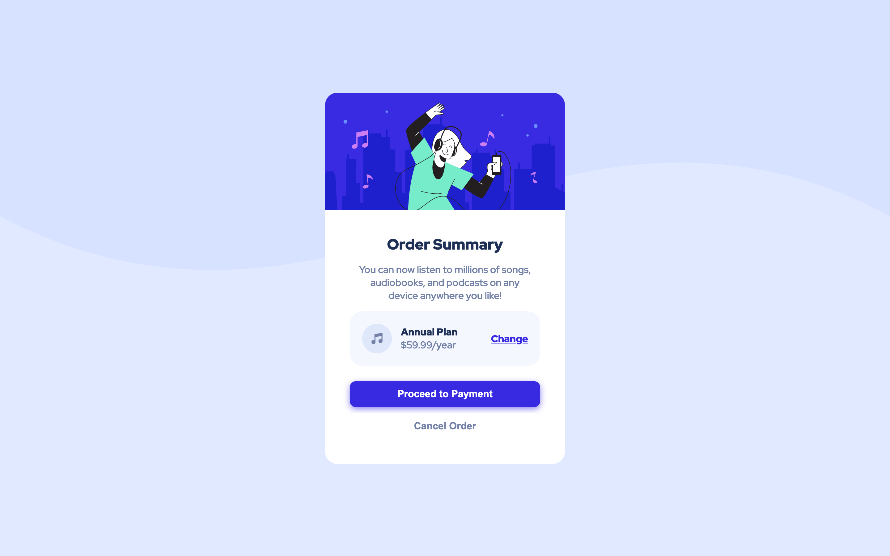
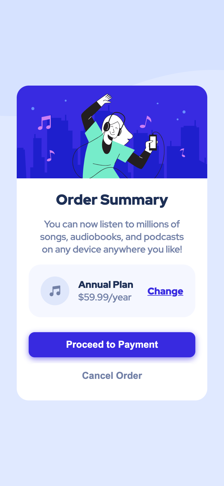

# codeNitesh - Order summary card

## Welcome! 👋

Thanks for checking out this front-end coding challenge.

**To do this challenge, you need a basic understanding of HTML and CSS.**

## Screenshots

- Desktop 1440px 
- Mobile: 375px 

## The challenge

The challenge is to build out this order summary card component and get it looking as close to the design as possible.

You can use any tools you like to help you complete the challenge. So if you've got something you'd like to practice, feel free to give it a go.

Your users should be able to:

- See hover states for interactive elements

## Deploying the project

Here is the link of GitHub Pages, where I deployed the project:

- [GitHub Pages](https://codenitesh.github.io/shoramess/)

This challenge is completely free. Please share it with anyone who will find it useful for practice.

**Have fun building!** 🚀
